<div align="center">

[](https://github.com/ria0304/lumen)


# Lumen

**A 32-bit x86 operating system, built from a raw boot sector up.**

Lumen is written in C and assembly, with a custom BIOS boot sector and a freestanding C kernel.
It is developed and tested exclusively under QEMU. Paging, a physical frame allocator, a
free-list heap, preemptive multitasking, Ring 3 user mode, a 20-call system call ABI,
a disk driver with DMA, a filesystem (LumenFS), an ELF loader, and a text-mode GUI are all
implemented.

</div>

---

## Status

**Active development, past the "bring-up" stage.** The system boots from a raw disk image,
enters protected mode, and transfers control to a C kernel that brings up a full IDT (all 32
exception vectors, all 16 IRQ vectors, and a DPL-3 syscall gate at `int 0x80`), a GDT with a TSS,
paging with per-task address spaces, a bitmap frame allocator, a free-list heap with `kfree`, a
round-robin preemptive scheduler that runs both Ring 0 and Ring 3 tasks, and an interactive shell.
Every subsystem below runs a self-test at boot and prints PASS/FAIL to the screen before the
kernel drops into its idle loop. See [Current State](#current-state) for the honest breakdown, and
[Known Limitations](#known-limitations) for what will bite you first.

---

## Table of Contents

- [Current State](#current-state)
- [Boot Sequence](#boot-sequence)
- [Architecture](#architecture)
- [Memory Layout](#memory-layout)
- [Design Decisions](#design-decisions)
- [Known Limitations](#known-limitations)
- [Building and Running](#building-and-running)
- [Repository Layout](#repository-layout)
- [Roadmap](#roadmap)
- [Testing Environment](#testing-environment)
- [License](#license)

---

## Current State

| Component | Status | Notes |
|---|---|---|
| Boot sector (real mode to protected mode) | Implemented | Loads the kernel, enables A20, loads the GDT, switches mode. Now reads 56 sectors (28 KiB), up from the original 8 — see [Known Limitations](#known-limitations) for how much of that margin is left |
| Kernel entry point | Implemented | Assembly stub sets the stack and calls `kmain()` |
| GDT | Implemented | `gdt_init()` (`kernel/gdt.c`) builds flat kernel code/data segments plus Ring 3 code/data descriptors and a TSS descriptor; `gdt_run_self_test()` checks it at boot |
| TSS | Implemented | `kernel/tss.c` / `tss_load.asm` load a single hardware TSS used for the Ring 3 -> Ring 0 stack switch on interrupt/syscall entry; `tss_set_esp0()` is repointed per-task by the scheduler |
| VGA text output | Implemented | `kernel/console.c` scrolls the screen when it fills, moves the hardware text cursor via ports `0x3D4`/`0x3D5`, and exposes `console_info` / `console_warn` / `console_error` on top of raw `terminal_write` / `terminal_putchar` |
| IDT and exception handlers | Implemented | `idt_init()` (`kernel/idt.c`) populates all 32 CPU exception vectors, all 16 remapped IRQ vectors, and a DPL-3 gate at vector `0x80` for syscalls. `exception_handler()` in `kernel.c` decodes and prints every vector by name and, for page faults, reads and prints `CR2` |
| PIC remapping | Implemented | `pic_init()` (`kernel/pic.c`) remaps IRQ 0-7 to vectors 32-39 and IRQ 8-15 to 40-47, masks every line except IRQ0/IRQ1 at boot, and unmasks others only as their handlers are wired up |
| PIT timer | Implemented | `pit_init(100)` drives IRQ0 at 100 Hz. The handler now also feeds the scheduler (`scheduler_irq()`) on every tick, so the timer is the preemption source, not just a clock |
| Keyboard driver | Implemented | `kbd_handler()` tracks Shift and feeds ASCII into the line editor. Still no Caps Lock or extended (`0xE0`-prefixed) scancodes |
| Line editor / shell | Implemented | `kernel/line_editor.c` buffers a line with backspace support; `kernel/shell.c` parses it and runs one of `help`, `clear`, `echo`, `about`, `version`, `mem`, `uptime`, `task`, `taskuser`, `taskkill`, `tasks`, `usermode` |
| Paging | Implemented | `kernel/paging.c` sets up the master kernel page directory, supports mapping/unmapping/querying individual pages, and — the significant addition — `paging_create_address_space()` / `paging_map_in_directory()` / `paging_switch_directory()` give **each Ring 3 task its own page directory**, switched on every context switch |
| Physical frame allocator | Implemented | `kernel/frame.c` is a bitmap allocator (`frame_alloc` / `frame_free`) over the first 16 MiB of physical RAM (`FRAME_MEMORY_LIMIT`), independent of and layered under the heap |
| Kernel heap | Implemented | `kernel/heap.c` has grown from a bump allocator into a real free-list allocator: `kmalloc()` splits blocks, `kfree()` exists and coalesces. It is **not** interrupt-safe (see [Known Limitations](#known-limitations)) |
| Tasks and scheduler | Implemented | `kernel/task.c` supports up to `MAX_TASKS` (16) tasks in Ring 0 or Ring 3, each with its own stack and (for Ring 3) address space. `kernel/scheduler.c` is a round-robin preemptive scheduler driven off the PIT tick, with `task_yield`, `task_block`, `task_wake`, `task_exit`/`task_terminate` |
| Ring 3 / user mode | Implemented | `kernel/ring3.c` and `usermode.asm` map a tiny hand-assembled user program (`mov eax,1` / `int 0x80` / `jmp $`) into user-accessible pages and enter it via `enter_user_mode`; reachable through both the legacy `usermode` shell command and per-task `taskuser` |
| System calls | Implemented | `kernel/syscall.c`'s `syscall_handler()` confirms the DPL-3 gate and Ring 3 entry/return work (it prints a PASS line) but does not yet read `eax` as a real syscall number or dispatch to a table — there is exactly one "syscall" |
| Fault isolation | Implemented | A Ring 3 task that faults with a recoverable vector (divide-by-zero, GPF, page fault, etc.) is terminated by `exception_handler()` and the CPU is redirected into a kernel halt loop instead of crashing the whole machine; a Ring 0 fault still halts everything |
| Filesystem | Implemented | LumenFS: format/mount/ls/cat/write/rm/mkdir + open/read/write/seek handles |
| Disk driver | Implemented | ATA PIO/DMA; the boot sector's own CHS read is the only disk I/O in the project |
| Graphical interface | Implemented (minimal) | Text-mode desktop via `gui` command + GUI self-test |
| Shell power pack | Implemented | real pipes (`echo hi \| cat \| wc`), `>`/`>>`/`<" redirection, `jobs`/`fg`/`bg`/`&`, `;`, `if exists..then`, `run` scripts, `sleep`, `wc`, interactive `edit` |
| Virtual FS | Implemented | `cat /proc/meminfo|version|uptime`, `ls /proc|/dev`, `/dev/null|zero` |
| Networking | Implemented | RTL8139 PCI driver (polling TX/RX), ARP table, IP checksum, ICMP echo; `ping [IP]`, `netstat`, `arp`; loopback fallback |
| Admin/Linux parity | Implemented | `uname`, `top`, `dmesg` (klog), `kill`, `chmod`, `sudo`, `useradd/login/whoami`, `ifconfig/ping`, `pkg`, `edit`, `files`, /etc/settings persistence |
| Advanced settings | Implemented | `settings`/`set`/`get`/`hostname`, persistent `/etc/settings` on LumenFS; `poweroff`/`reboot`; `SYS_GETTIME`/`SYS_REBOOT` |

---

## Boot Sequence

1. The BIOS loads the 512-byte boot sector (`boot/boot.asm`) to `0x7C00`.
2. The boot sector reads 56 sectors (28 KiB) containing the kernel to physical address `0x10000`
   via CHS `int 0x13`. This is still a fixed read count, not a measurement of the current kernel's
   size — see [Known Limitations](#known-limitations) for how close that number already is to the
   actual kernel image.
3. It enables the A20 line using the fast method (port `0x92`), loads the GDT, and sets the PE bit
   in `CR0`.
4. A far jump into the 32-bit code segment flushes the prefetch queue. Segment registers are loaded
   with the data selector and the stack pointer is set to `0x90000`.
5. Control passes to `0x10000`, where `kernel/entry.asm` calls `kmain()` in `kernel/kernel.c`.
6. `kmain()` runs, in order: `terminal_clear()`, `tss_init()` / `gdt_init()` / `tss_load()` (with a
   GDT self-test and a TSS self-test), `idt_init()` (with a self-test), `paging_init()` and
   `frame_init()` (each with a self-test), `pic_init()`, `pit_init(100)`, `kbd_init()`,
   `line_editor_init()`, `shell_init()`, `task_init()` (with a self-test), `scheduler_init()` (with
   a self-test), and `heap_init()` (with a self-test plus a smoke-test allocation). Each step prints
   a status line, so a failure at any stage is visible on screen rather than silent. Once every
   self-test has run, `sti` is executed and the kernel idles in a `hlt` loop; from there IRQ0
   (timer, which also drives the scheduler) and IRQ1 (keyboard) events are serviced, and the shell
   prompt accepts input.

During the real-mode phase the boot sector prints status markers through BIOS teletype output:
`READ_OK`, `A20_OK`, `GDT_OK`, and `PM_START`. A failed disk read prints `DISK_ERROR` and halts.
Immediately after the mode switch, the characters `A`, `B`, `C` are written directly to VGA memory
as a protected-mode sanity check.

---

## Architecture

```mermaid
flowchart TD

subgraph group_boot["Boot and Entry"]
  node_bootloader["Bootloader<br/>[boot.asm]"]
  node_entry["Kernel Entry<br/>[entry.asm]"]
end

subgraph group_kernel["Kernel Foundations"]
  node_kernel_main["Kernel Init<br/>[kernel.c]"]
  node_gdt["GDT<br/>[gdt.c]"]
  node_tss["TSS<br/>[tss.c]"]
  node_idt["Interrupt Table<br/>[idt.c]"]
  node_isr["Interrupt Stubs<br/>[isr.asm]"]
  node_pic["PIC<br/>[pic.c]"]
  node_pit["Timer<br/>[pit.c]"]
end

subgraph group_memory["Memory Management"]
  node_frame["Frame Allocator<br/>[frame.c]"]
  node_paging["Paging<br/>[paging.c]"]
  node_heap["Kernel Heap<br/>[heap.c]"]
end

subgraph group_interaction["Console and Shell"]
  node_keyboard["Keyboard Driver<br/>[keyboard.c]"]
  node_editor["Line Editor<br/>[line_editor.c]"]
  node_shell["Interactive Shell<br/>[shell.c]"]
  node_console["VGA Console<br/>[console.c]"]
end

subgraph group_execution["Tasks and Protection"]
  node_task["Task Manager<br/>[task.c]"]
  node_scheduler["Scheduler<br/>[scheduler.c]"]
  node_ring3["User Mode<br/>[ring3.c]"]
  node_user_asm["User Program<br/>[usermode.asm]"]
  node_syscall["Syscall Handler<br/>[syscall.c]"]
end

node_bios(("BIOS"))
node_keyboard_user(("Keyboard User"))

node_bios -->|"loads sector"| node_bootloader
node_bootloader -->|"loads kernel"| node_entry
node_entry -->|"calls kmain"| node_kernel_main
node_kernel_main -->|"initializes"| node_gdt
node_kernel_main -->|"initializes"| node_tss
node_kernel_main -->|"initializes"| node_idt
node_kernel_main -->|"initializes"| node_paging
node_kernel_main -->|"initializes"| node_frame
node_kernel_main -->|"initializes"| node_pic
node_kernel_main -->|"initializes"| node_pit
node_kernel_main -->|"initializes"| node_keyboard
node_kernel_main -->|"initializes"| node_editor
node_kernel_main -->|"initializes"| node_shell
node_kernel_main -->|"initializes"| node_task
node_kernel_main -->|"initializes"| node_scheduler
node_kernel_main -->|"initializes"| node_heap
node_idt -->|"loads stubs"| node_isr
node_keyboard_user -->|"presses keys"| node_keyboard
node_keyboard -->|"sends characters"| node_editor
node_editor -->|"submits line"| node_shell
node_shell -->|"prints output"| node_console
node_shell -->|"manages tasks"| node_task
node_shell -->|"enters user mode"| node_ring3
node_task -->|"creates address spaces"| node_paging
node_task -->|"allocates frames"| node_frame
node_task -->|"sets up user task"| node_ring3
node_user_asm -->|"provides enter_user_mode / iret"| node_ring3
node_pit -->|"ticks scheduler"| node_scheduler
node_scheduler -->|"selects task"| node_task
node_scheduler -->|"switches directory"| node_paging
node_scheduler -->|"sets kernel stack"| node_tss
node_idt -->|"routes syscall gate"| node_syscall
node_kernel_main -->|"reports status"| node_console

click node_bootloader "https://github.com/ria0304/lumen/blob/main/boot/boot.asm"
click node_entry "https://github.com/ria0304/lumen/blob/main/kernel/entry.asm"
click node_kernel_main "https://github.com/ria0304/lumen/blob/main/kernel/kernel.c"
click node_gdt "https://github.com/ria0304/lumen/blob/main/kernel/gdt.c"
click node_tss "https://github.com/ria0304/lumen/blob/main/kernel/tss.c"
click node_idt "https://github.com/ria0304/lumen/blob/main/kernel/idt.c"
click node_isr "https://github.com/ria0304/lumen/blob/main/kernel/isr.asm"
click node_pic "https://github.com/ria0304/lumen/blob/main/kernel/pic.c"
click node_pit "https://github.com/ria0304/lumen/blob/main/kernel/pit.c"
click node_frame "https://github.com/ria0304/lumen/blob/main/kernel/frame.c"
click node_paging "https://github.com/ria0304/lumen/blob/main/kernel/paging.c"
click node_heap "https://github.com/ria0304/lumen/blob/main/kernel/heap.c"
click node_keyboard "https://github.com/ria0304/lumen/blob/main/kernel/keyboard.c"
click node_editor "https://github.com/ria0304/lumen/blob/main/kernel/line_editor.c"
click node_shell "https://github.com/ria0304/lumen/blob/main/kernel/shell.c"
click node_console "https://github.com/ria0304/lumen/blob/main/kernel/console.c"
click node_task "https://github.com/ria0304/lumen/blob/main/kernel/task.c"
click node_scheduler "https://github.com/ria0304/lumen/blob/main/kernel/scheduler.c"
click node_ring3 "https://github.com/ria0304/lumen/blob/main/kernel/ring3.c"
click node_user_asm "https://github.com/ria0304/lumen/blob/main/kernel/usermode.asm"
click node_syscall "https://github.com/ria0304/lumen/blob/main/kernel/syscall.c"

classDef toneNeutral fill:#f8fafc,stroke:#334155,stroke-width:1.5px,color:#0f172a
classDef toneBlue fill:#dbeafe,stroke:#2563eb,stroke-width:1.5px,color:#172554
classDef toneAmber fill:#fef3c7,stroke:#d97706,stroke-width:1.5px,color:#78350f
classDef toneMint fill:#dcfce7,stroke:#16a34a,stroke-width:1.5px,color:#14532d
classDef toneRose fill:#ffe4e6,stroke:#e11d48,stroke-width:1.5px,color:#881337
classDef toneIndigo fill:#e0e7ff,stroke:#4f46e5,stroke-width:1.5px,color:#312e81
classDef toneTeal fill:#ccfbf1,stroke:#0f766e,stroke-width:1.5px,color:#134e4a
class node_bootloader,node_entry,node_keyboard_user toneBlue
class node_kernel_main,node_gdt,node_tss,node_idt,node_isr,node_pic,node_pit toneAmber
class node_frame,node_paging,node_heap toneMint
class node_keyboard,node_editor,node_shell,node_console toneRose
class node_task,node_scheduler,node_ring3,node_user_asm,node_syscall,node_bios toneIndigo
```



---

## Memory Layout

| Address | Purpose |
|---|---|
| `0x00007C00` | Boot sector, loaded by the BIOS. Also the initial real-mode stack top (grows down) |
| `0x00010000` | Kernel image (load address and link address) |
| `0x00090000` | Protected-mode stack top (grows down) |
| `0x00220000` | Master kernel page directory (`PAGE_DIRECTORY_ADDRESS`) |
| `0x00221000` | Master kernel's first page table (`PAGE_TABLE_ADDRESS`) |
| `0x00400000` | Kernel heap start (`HEAP_START`) — also the boundary of the identity-mapped region (`PAGING_IDENTITY_LIMIT`) that per-task page directories are allocated inside |
| `0x00C00000` / `0x00C01000` | Legacy single-instance Ring 3 code / stack, used by the `usermode` shell command |
| `0x01000000` / `0x01001000` | Per-task Ring 3 code / stack base, used by `taskuser` |
| `0x000B8000` | VGA text-mode buffer, 80x25 cells of 16 bits each |
| `0x00000000`-`0x00FFFFFF` (16 MiB) | Range tracked by the physical frame bitmap allocator (`FRAME_MEMORY_LIMIT`); physical memory above this is unmanaged |

---

## Design Decisions

- **Custom bootloader instead of GRUB.** The project is intended to cover the full path from power-on
  to a running kernel, so no third-party bootloader is used.
- **Flat GDT, plus dedicated Ring 3 and TSS descriptors.** Segmentation itself is still bypassed via
  4 GiB flat segments; memory protection comes from paging and the descriptor privilege levels
  (DPL 3 for user segments), not segment limits.
- **Fast A20 via port `0x92`.** It is compact and works under QEMU. It is not guaranteed on all
  real hardware, where the keyboard-controller method may be required.
- **Linked at `0x10000`.** `linker.ld` places `.text`, `.rodata`, `.data`, and `.bss` contiguously
  from the load address so the boot sector can jump directly to the start of the image.
- **PIC masks set explicitly, not inherited from the BIOS.** Every IRQ line is masked at boot and
  only unmasked once its handler is real. New devices should follow the same order: add the ISR
  stub and IDT gate first, unmask second.
- **One page directory per Ring 3 task.** `paging_create_address_space()` gives every Ring 3 task
  isolated virtual memory instead of sharing the kernel's directory, and the scheduler swaps `CR3`
  on every context switch (`paging_switch_directory()`). Kernel-ring tasks still share the single
  master directory — there is no isolation between them, by design, since they're trusted code.
- **New address-space page tables are populated before `CR3` is switched to them.** This is only
  safe because a new directory's backing frame is guaranteed to sit below
  `PAGING_IDENTITY_LIMIT` (4 MiB), which stays identity-mapped in the currently-active directory, so
  the kernel can write into a not-yet-active address space through its own mapping.
- **Round-robin scheduling driven off the PIT, with no priorities.** `scheduler_tick()` /
  `scheduler_irq()` walk `task_t` slots looking for the next `TASK_READY` entry after the current
  one. Simple, and fair in the sense that every ready task gets an equal-length slice, but there is
  no notion of priority, nice values, or fairness beyond that.
- **Fault-driven task teardown instead of a monolithic halt.** A Ring 3 fault on a small,
  deliberately conservative set of vectors (divide-by-zero, overflow, bound-range, GPF,
  stack-segment fault, page fault) now terminates just that task, rather than freezing the whole
  system — the same recovery path used for a normal yield or exit. A Ring 0 fault still halts
  everything, since the kernel is not expected to fault.
- **Free-list heap replacing the original bump allocator.** `kmalloc()`/`kfree()` now split and (per
  the block-header layout in `heap.c`) coalesce free blocks, rather than only ever moving a pointer
  forward. See [Known Limitations](#known-limitations) for the concurrency caveat that comes with
  turning on preemption over a heap that was written before preemption existed.

---

## Known Limitations

- **The fixed-sector boot load has almost no headroom left.** `boot.asm` now reads 56 sectors
  (28,672 bytes) via CHS `int 0x13`, up from the original 8 — but a from-scratch build of the
  current kernel already produces a 27,964-byte `kernel.bin`. That is **708 bytes**, about a page
  and a half, of remaining margin before the next feature silently truncates the loaded kernel with
  no error at boot time. This is the single most likely thing to break the build for the next
  person who adds a moderately-sized file. The right fix is deriving the sector count from the
  build (e.g. having `make` patch a sector count into the boot sector, or the boot sector reading a
  size prefix) rather than raising the constant again.
- **The kernel heap is not interrupt-safe.** `kmalloc()`/`kfree()` manipulate a shared free list
  with no `cli`/`sti` around the critical section, but the PIT now preempts through
  `scheduler_irq()` on every tick and can switch to another task — including one also calling into
  the allocator — in the middle of that manipulation. This has not shown up yet only because the
  self-tests are effectively single-threaded at the point they run; it becomes a real, silent
  heap-corruption risk as soon as two independently-scheduled tasks both allocate.
- **Naming inconsistency: "Lumen" vs "Lumer."** The project, repository, and this README are named
  Lumen, but the boot banner (`"Lumer kernel online!"`), the shell prompt (`Lumer>`), the `about`
  and `version` commands (`"Lumer OS."` / `"Lumer OS version 0.1"`), and the built image filename
  (`build/lumer.img`) all still say "Lumer." If this was originally a typo, it has since spread
  across enough user-facing strings and the Makefile that it now reads as intentional; either way,
  it's worth deciding one name and applying it everywhere rather than leaving both in the same
  boot sequence.
- **BIOS CHS disk access.** Adequate under QEMU, but not a viable long-term approach for larger
  images or real hardware.
- **Boot-sector GDT is replaced, not reused.** The real-mode GDT set up by `boot.asm` only exists
  to survive the mode switch; `gdt_init()` in the kernel builds its own flat/Ring-3/TSS GDT
  afterward, so the two are not the same table.
- **No `.bss` initialization.** The kernel entry stub does not zero `.bss`, which matters more now
  than it used to given how much more state (task table, frame bitmap, heap headers) is `static`.
- **No caps lock or extended scancodes.** `kbd_handler()` tracks Shift but not Caps Lock, and does
  not handle the `0xE0`-prefixed scancodes used for arrow keys, Home/End, etc.
- **No spurious-IRQ handling.** `pic_send_eoi()` sends EOI unconditionally based on the IRQ number
  passed in; it does not check the PIC's in-service register, so a spurious IRQ7/IRQ15 would be
  acknowledged as if it were real.
- **Frame allocator is capped at 16 MiB regardless of actual RAM.** `FRAME_MEMORY_LIMIT` is a
  compile-time constant; there is no memory-map probing (e.g. via BIOS `int 0x15, eax=0xE820`), so
  physical memory above 16 MiB is neither tracked nor usable even if QEMU is given more.
  `MAX_TASKS` is similarly a fixed compile-time ceiling of 16.
- **Syscalls are a proof of concept, not an ABI.** `syscall_handler()` confirms the Ring 3 -> Ring 0
  transition through the `int 0x80` gate works, but it does not read `eax` as a syscall number or
  dispatch anywhere; there is exactly one "syscall," and it does the same thing regardless of what
  the caller passed.
- **`.gitignore` didn't cover the debug-backup directories.** `.ring3_backup_*/` snapshots made
  during ring3 debugging sessions were previously untracked by `.gitignore` and had to be deleted by
  hand. A `.ring3_backup_*/` wildcard entry is now in `.gitignore`, so future ones won't get staged
  by accident — but there's nothing stopping a *differently-named* debug snapshot from doing the
  same thing later. Worth a quick look before committing if you start backing up other files mid-session.
- **`run.sh` is still an empty file.** Use `make run` or the direct QEMU invocation below.

---

## Building and Running

### Requirements

- GCC with 32-bit support (`gcc-multilib` on Debian/Ubuntu)
- GNU binutils
- NASM
- QEMU (`qemu-system-x86`)
- GDB (optional, for debugging)

```bash
sudo apt install build-essential gcc-multilib nasm qemu-system-x86 gdb
```

### Build

```bash
make
```

This assembles the boot sector and every kernel object — `entry.asm`, `usermode.asm`, `isr.asm`,
`gdt_flush.asm`, `tss_load.asm`, `gdt.c`, `tss.c`, `kernel.c`, `console.c`, `idt.c`, `pic.c`,
`pit.c`, `keyboard.c`, `heap.c`, `line_editor.c`, `shell.c`, `task.c`, `scheduler.c`,
`task_demo.c`, `paging.c`, `frame.c`, `ring3.c`, `syscall.c` — links them against `linker.ld`, and
concatenates the raw boot sector binary with the raw kernel binary into `build/lumer.img`,
truncated/padded to a 1.44 MiB floppy image. This was verified against the current source: a clean
build compiles and links without errors (two linker notices — an executable-stack warning from
`tss_load.o` and an RWX `LOAD` segment warning — are expected and non-fatal). `make clean` removes
the `build/` directory.

### Run

```bash
make run
```

Equivalent direct invocation:

```bash
qemu-system-i386 -fda build/lumer.img
```

---

## Repository Layout

```
Lumen/
├── boot/
│   ├── boot.asm         Boot sector: kernel load (56 sectors), A20, GDT, protected-mode switch
│   └── boot_day1.asm    Early 16-bit prototype; retained for reference, not part of the build
├── kernel/
│   ├── entry.asm        32-bit entry stub: stack setup, calls kmain()
│   ├── kernel.c         kmain(), exception/timer dispatch, boot self-test sequencing
│   ├── console.c/.h     VGA terminal: scrolling, hardware cursor, info/warn/error helpers
│   ├── gdt.c/.h         Flat + Ring 3 + TSS descriptors, gdt_flush.asm
│   ├── tss.c/.h         Hardware TSS, tss_load.asm, per-task esp0 updates
│   ├── idt.c/.h         Full IDT: 32 exceptions, 16 IRQs, DPL-3 syscall gate
│   ├── isr.asm          ISR/IRQ/syscall stubs and lidt wrapper
│   ├── pic.c/.h         8259 PIC remap (IRQ0-15 -> vectors 32-47), explicit mask, EOI
│   ├── pit.c/.h         8253/8254 PIT channel 0 programming
│   ├── keyboard.c       IRQ1 handler: scancode-to-ASCII with Shift tracking
│   ├── line_editor.c/.h Line buffering with backspace, feeds the shell
│   ├── shell.c/.h       Command parser: help/clear/echo/about/version/mem/uptime/task/.../usermode
│   ├── paging.c/.h      Master directory, per-task address spaces, map/unmap/query API
│   ├── frame.c/.h       Bitmap physical frame allocator (16 MiB range)
│   ├── heap.c/.h        Free-list allocator: kmalloc + kfree, splitting/coalescing
│   ├── task.c/.h        Task table, create/terminate/block/wake/yield/exit
│   ├── task_demo.c      Trivial task entry point used by task_create() (hlt loop)
│   ├── scheduler.c/.h   Round-robin preemptive scheduler, PIT-driven
│   ├── ring3.c/.h       Ring 3 program mapping + entry, shared by usermode/taskuser
│   ├── usermode.asm     enter_user_mode: iret into Ring 3
│   ├── syscall.c/.h     int 0x80 handler (proof-of-concept, single syscall)
│   └── privilege.h      Ring/selector constants shared across the above
├── linker.ld            Linker script (kernel linked at 0x10000)
├── Makefile             Build automation (verified: produces build/lumer.img cleanly)
└── run.sh               QEMU launch script (still empty — use `make run`)
```

Timestamped `.ring3_backup_*/` snapshot directories show up here periodically during ring3
debugging sessions. They've been deleted as of this revision and `.gitignore` now has a
`.ring3_backup_*/` wildcard entry, so new ones won't get committed — see
[Known Limitations](#known-limitations) for the caveat that a differently-named snapshot wouldn't be caught by that same rule.

---

## Roadmap

Milestones are listed in intended order.

1. **Boot and kernel foundation** (done): boot sector, protected mode, C entry, VGA output driver
   with scrolling and a hardware cursor.
2. **Interrupts and input** (done): full IDT (all exceptions, all IRQs, syscall gate), PIC remap
   with explicit masking, a PIT-driven IRQ0 timer, and an IRQ1 keyboard driver with Shift support.
   Remaining: Caps Lock, extended scancodes, spurious-IRQ handling.
3. **Memory management** (done for the core, hardening remains): paging with per-task address
   spaces, a bitmap frame allocator, and a free-list heap with `kfree` are all working. Remaining:
   make the heap interrupt-safe, probe the real memory map instead of a fixed 16 MiB limit, derive
   the boot sector's sector count from the build instead of a hand-raised constant.
4. **Processes and shell** (done for the core): preemptive round-robin scheduling across Ring 0 and
   Ring 3 tasks, per-task address spaces, fault isolation that kills a faulted task instead of the
   machine, a `int 0x80` syscall gate, and an interactive shell. Remaining: a real syscall ABI and
   dispatch table (today there is exactly one syscall), priorities/fairness beyond round-robin, and
   more than `MAX_TASKS` (16) concurrent tasks if that ceiling turns out to matter.
5. **Storage and filesystem** (done): ATA driver with DMA and LumenFS with file/dir/symlink APIs.
6. **Utilities and stabilization** (done for core): `run`/`install` load flat + ELF programs from LumenFS; heap is interrupt-safe, `.bss` zeroed, CapsLock/extended scancodes + spurious-IRQ handling present.
7. **Graphics** (done, minimal): text-mode desktop (`kernel/gui.c`, `gui` command, GUI self-test). Full VESA framebuffer/mouse remains future work.

The project is developed part-time with a target of April 2027. Completing milestones 1 through 5
is considered a successful outcome; milestone 7 is optional.

---

## Testing Environment

Lumen is developed against QEMU (`qemu-system-i386 -fda build/lumer.img`) on Ubuntu. It has not
been tested on physical hardware, and it does not write to any physical disk. The build itself
(NASM assembly, GCC compilation, and linking into `build/lumer.img`) was independently re-verified
against the current source while writing this README; it completes without errors.

---

## License

MIT.
