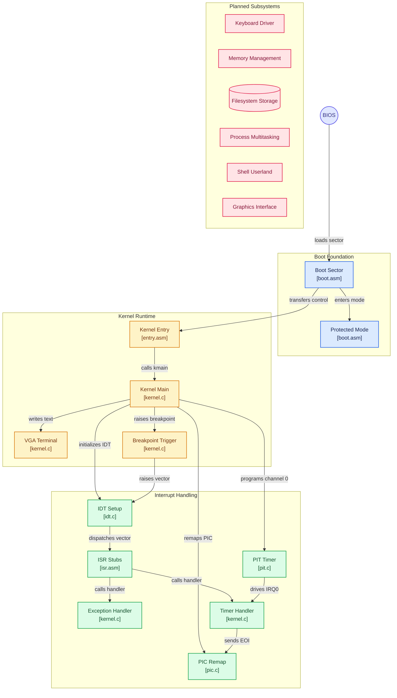

<div align="center">

[](https://github.com/ria0304/lumen)


# Lumen

**A 32-bit x86 operating system, built from a raw boot sector up.**

Lumen is written in C and assembly, with a custom BIOS boot sector and a freestanding C kernel.
It is developed and tested exclusively under QEMU. A physical memory allocator, filesystem,
multitasking, and a shell are planned but not yet implemented.

</div>

---

## Status

**Early development.** The system boots from a raw disk image, enters protected mode, transfers
control to a C kernel, and now has a working interrupt pipeline: CPU exceptions, a remapped PIC,
a PIT timer driving IRQ0, and a keyboard driver driving IRQ1 with shift-key support. A first-pass
bump allocator (`kmalloc`) is also in place. See [Current State](#current-state) for the honest
breakdown.

---

## Table of Contents

- [Current State](#current-state)
- [Boot Sequence](#boot-sequence)
- [Architecture](#architecture)
- [Memory Layout](#memory-layout)
- [Design Decisions](#design-decisions)
- [Known Limitations](#known-limitations)
- [Building and Running](#building-and-running)
- [Repository Layout](#repository-layout)
- [Roadmap](#roadmap)
- [Testing Environment](#testing-environment)
- [License](#license)

---

## Current State

| Component | Status | Notes |
|---|---|---|
| Boot sector (real mode to protected mode) | Implemented | Loads kernel, enables A20, loads GDT, switches mode |
| Kernel entry point | Implemented | Assembly stub sets the stack and calls `kmain()` |
| GDT | Implemented | Flat code and data segments, defined in the boot sector |
| VGA text output | Partial | Direct writes in `kmain()`; `terminal_putchar()` handles `\n` and `\b` (backspace erases the previous cell), but there is still no cursor or scrolling — output wraps to row 0 when it runs off the bottom |
| IDT and exception handlers | Partial | `idt_init()` (`kernel/idt.c`) populates gates for vector 0 (divide-by-zero), vector 3 (breakpoint), vector 32 (IRQ0/timer), and vector 33 (IRQ1/keyboard). The remaining 252 entries are left null. `kmain()` self-tests by executing `int $3` right after `idt_init()` runs |
| PIC remapping | Implemented | `pic_init()` (`kernel/pic.c`) remaps IRQ 0-7 to vectors 32-39 and IRQ 8-15 to 40-47, then explicitly masks every line except IRQ0 and IRQ1 rather than trusting whatever mask the BIOS left behind. `pic_send_eoi()` is called from both the timer and keyboard handlers |
| PIT timer | Implemented | `pit_init()` (`kernel/pit.c`) programs channel 0 for a configurable frequency; `kmain()` calls it at 100 Hz. `timer_handler()` in `kernel.c` increments a tick counter and renders the low 16 bits as hex in the top-right of the screen on every tick, plus an elapsed-seconds readout |
| Keyboard driver | Implemented | `kbd_handler()` (`kernel/keyboard.c`) reads scancodes from IRQ1, tracks left/right Shift via make/break codes, and maps to ASCII through separate unshifted and shifted US layout tables. Backspace is forwarded to `terminal_putchar()`. No caps lock, extended (0xE0-prefixed) scancodes, or non-US layouts yet |
| Physical memory allocator | Partial | `kernel/heap.c` is a bump allocator: `kmalloc()` hands out 4-byte-aligned chunks from a fixed 64 KiB region starting at `0x200000` and never frees. No `kfree`, no page-level allocator, no fragmentation handling |
| Filesystem | Not started | |
| Processes and multitasking | Not started | |
| Shell and userland utilities | Not started | |
| Graphical interface | Not planned yet | Stretch goal |

---

## Boot Sequence

1. The BIOS loads the 512-byte boot sector (`boot/boot.asm`) to `0x7C00`.
2. The boot sector reads 8 sectors (4 KiB) containing the kernel to physical address `0x10000`
   via CHS `int 0x13`. This is a fixed read count, not a measurement of the current kernel's
   size — see [Known Limitations](#known-limitations).
3. It enables the A20 line using the fast method (port `0x92`), loads the GDT, and sets the PE bit
   in `CR0`.
4. A far jump into the 32-bit code segment flushes the prefetch queue. Segment registers are loaded
   with the data selector and the stack pointer is set to `0x90000`.
5. Control passes to `0x10000`, where `kernel/entry.asm` calls `kmain()` in `kernel/kernel.c`.
6. `kmain()` clears the VGA buffer, prints status lines, then calls `idt_init()`, `pic_init()`,
   `pit_init(100)`, `kbd_init()`, and `heap_init()` in sequence, printing a status line after each.
   As a smoke test of the new allocator, it also calls `kmalloc(64)`, copies a message into the
   returned buffer, and prints both the message and `heap_used()`. It executes `int $3` to trigger
   the breakpoint handler as a self-test — `exception_handler()` prints a confirmation and halts —
   before interrupts are enabled. Assuming that self-test passes, `sti` is executed and the kernel
   idles in a `hlt` loop, from which IRQ0 (timer) and IRQ1 (keyboard) events are serviced.

During the real-mode phase the boot sector prints status markers through BIOS teletype output:
`READ_OK`, `A20_OK`, `GDT_OK`, and `PM_START`. A failed disk read prints `DISK_ERROR` and halts.
Immediately after the mode switch, the characters `A`, `B`, `C` are written directly to VGA memory
as a protected-mode sanity check.

---

## Architecture

> Boot Foundation, Kernel Runtime, and Interrupt Handling are all real, shipped code. Interrupt
> Handling now covers four populated IDT vectors — divide-by-zero, breakpoint, the PIC-remapped
> hardware timer on IRQ0, and the keyboard on IRQ1 — plus a working PIC remap (with everything else
> explicitly masked) and PIT. It does not cover any other hardware interrupt; vectors 4 through 31
> besides 0 and 3, and every vector from 34 onward, are still null and will triple-fault the machine
> if raised. A first-pass bump allocator (`kernel/heap.c`) also exists but isn't shown as its own
> node below yet. Planned Subsystems is the honest label for everything that group represents — none
> of it exists yet.



---

## Memory Layout

| Address | Purpose |
|---|---|
| `0x00007C00` | Boot sector, loaded by the BIOS. Also the initial real-mode stack top (grows down) |
| `0x00010000` | Kernel image (load address and link address) |
| `0x00090000` | Protected-mode stack top (grows down) |
| `0x000B8000` | VGA text-mode buffer, 80x25 cells of 16 bits each |

---

## Design Decisions

- **Custom bootloader instead of GRUB.** The project is intended to cover the full path from power-on
  to a running kernel, so no third-party bootloader is used.
- **Flat GDT.** The GDT contains a null descriptor and two 4 GiB flat segments (code and data,
  ring 0, 32-bit, 4 KiB granularity). Segmentation is effectively bypassed; memory protection is
  expected to come from paging later.
- **Fast A20 via port `0x92`.** It is compact and works under QEMU. It is not guaranteed on all
  real hardware, where the keyboard-controller method may be required.
- **Linked at `0x10000`.** `linker.ld` places `.text`, `.rodata`, `.data`, and `.bss` contiguously
  from the load address so the boot sector can jump directly to the start of the image.
- **PIC masks set explicitly, not inherited from the BIOS.** `pic_init()` used to preserve whatever
  mask the BIOS left behind, which meant IRQ1 (keyboard) could be unmasked with no IDT gate behind
  it — an unhandled interrupt that triple-faulted the machine back to BIOS. `pic_init()` now masks
  every IRQ except 0 and 1 outright, and a line is only unmasked once its handler is real (currently
  IRQ0 and IRQ1). This should be the pattern for every future IRQ: add the ISR stub and IDT gate
  first, unmask second.
- **Bump allocator instead of a real heap.** `kmalloc()` only moves a pointer forward through a
  fixed 64 KiB region and never frees; it exists to unblock later subsystems that need dynamic
  allocation (a keyboard input buffer, for instance) before a proper free-list or slab allocator is
  worth building.

---

## Known Limitations

- **Fixed 8-sector kernel load.** `boot.asm` reads exactly 8 sectors (4 KiB) via CHS `int 0x13`,
  regardless of the kernel's actual size. The kernel currently fits well within that, but the read
  count is not derived from the build output — it will silently stop loading the full kernel once
  the linked image exceeds 4 KiB, with no error raised at boot time.
- **BIOS CHS disk access.** Adequate under QEMU, but not a viable long-term approach for larger
  images or real hardware.
- **Boot-sector GDT.** The GDT lives in the boot sector's address range and is not owned by the
  kernel. It should be re-established in kernel code once the kernel has its own memory layout.
- **No `.bss` initialization.** The kernel entry stub does not zero `.bss`. This has no effect yet
  because the kernel has no uninitialized globals.
- **Only four IDT vectors are populated.** `idt_init()` sets gates for vector 0, vector 3, vector 32
  (IRQ0), and vector 33 (IRQ1) and leaves the remaining 252 entries null. Any other exception (e.g.
  a general protection fault or page fault, once paging exists) or hardware interrupt still has no
  handler installed and will triple-fault the machine if raised. The PIC mask is set up correctly to
  prevent this for every currently-unhandled line, but adding a new device means updating the IDT,
  the ISR table in `isr.asm`, and the PIC mask together, in that order — see the note on PIC masking
  under [Design Decisions](#design-decisions).
- **No caps lock or extended scancodes.** `kbd_handler()` tracks Shift but not Caps Lock, and does
  not handle the 0xE0-prefixed scancodes used for arrow keys, Home/End, etc. — those bytes are
  currently just dropped by the `scancode < 128` check.
- **No spurious-IRQ handling.** `pic_send_eoi()` sends EOI unconditionally based on the IRQ number
  passed in; it does not check the PIC's in-service register, so a spurious IRQ7/IRQ15 would be
  acknowledged as if it were real.
- **Heap has no `kfree` and no bounds enforcement beyond a single check.** `kmalloc()` refuses an
  allocation that would exceed the 64 KiB region, but nothing reclaims memory, and there is no
  guard against the heap region itself colliding with other physical memory usage as the kernel
  grows.
- **Boot message typo.** `kmain()` prints `"Lumer kernel online!"` instead of `"Lumen kernel
  online!"` — a one-character fix in `kernel/kernel.c`.

---

## Building and Running

**Note:** the `Makefile` is written and working. `run.sh` is still empty; use `make run` or the
direct QEMU invocation below until it's filled in.

### Requirements

- GCC with 32-bit support (`gcc-multilib` on Debian/Ubuntu)
- GNU binutils
- NASM
- QEMU (`qemu-system-x86`)
- GDB (optional, for debugging)

```bash
sudo apt install build-essential gcc-multilib nasm qemu-system-x86 gdb
```

### Build

```bash
make
```

This assembles the boot sector and every kernel object (`entry.asm`, `isr.asm`, `kernel.c`, `idt.c`,
`pic.c`, `pit.c`, `keyboard.c`, `heap.c`), links them against `linker.ld`, and concatenates the raw
boot sector binary with the raw kernel binary into `build/lumer.img`, truncated/padded to a 1.44 MiB
floppy image. `make clean` removes the `build/` directory.

### Run

```bash
make run
```

Equivalent direct invocation:

```bash
qemu-system-i386 -fda build/lumer.img
```

---

## Repository Layout

```
Lumen/
├── boot/
│   ├── boot.asm        Boot sector: kernel load, A20, GDT, protected-mode switch
│   └── boot_day1.asm   Early 16-bit prototype; retained for reference, not part of the build
├── kernel/
│   ├── entry.asm       32-bit entry stub: stack setup, calls kmain()
│   ├── kernel.c        Kernel main: VGA output, exception/timer handlers, heap smoke test, idle loop
│   ├── idt.c / idt.h   IDT setup for vectors 0, 3, 32, and 33
│   ├── isr.asm         ISR/IRQ stubs (isr0, isr3, irq0, irq1) and lidt wrapper
│   ├── pic.c / pic.h   8259 PIC remap (IRQ0-15 -> vectors 32-47), explicit mask, and EOI
│   ├── pit.c / pit.h   8253/8254 PIT channel 0 programming
│   ├── keyboard.c      IRQ1 handler: scancode-to-ASCII with Shift tracking, backspace
│   └── heap.c / heap.h Bump allocator (kmalloc, no kfree)
├── linker.ld           Linker script (kernel linked at 0x10000)
├── Makefile             Build automation (working: produces build/lumer.img)
└── run.sh              QEMU launch script (not yet written)
```

---

## Roadmap

Milestones are listed in intended order.

1. **Boot and kernel foundation** (done): boot sector, protected mode, C entry, VGA output driver.
2. **Interrupts and input** (in progress): CPU exception handling (divide-by-zero, breakpoint), PIC
   remap with explicit masking, a PIT-driven IRQ0 timer, and an IRQ1 keyboard driver with Shift
   support are all working. Remaining: gates for the other exception vectors (GPF, page fault,
   etc.), caps lock and extended-scancode handling, and a real IRQ mask/unmask API rather than the
   current fixed mask set in `pic_init()`.
3. **Memory management** (in progress): a bump allocator (`kmalloc`, no `kfree`) is working.
   Remaining: a physical page allocator, `kfree`/reclamation, and paging.
4. **Storage and filesystem**: disk driver and a simple filesystem.
5. **Processes and shell**: task switching, system calls, and an interactive shell.
6. **Utilities and stabilization**: basic userland programs and hardening.
7. **Graphics** (stretch): framebuffer and a minimal GUI.

The project is developed part-time with a target of April 2027. Completing milestones 1 through 5 is
considered a successful outcome; milestone 7 is optional.

---

## Testing Environment

Lumen is run exclusively as a QEMU virtual machine on Ubuntu. It has not been tested on physical
hardware, and it does not write to any physical disk.

---
