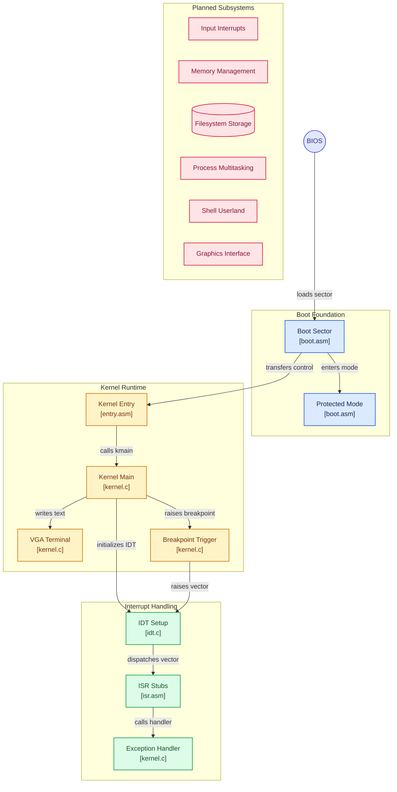

<div align="center">

[](https://github.com/ria0304/lumen)


# Lumen

**A 32-bit x86 operating system, built from a raw boot sector up.**

Lumen is written in C and assembly, with a custom BIOS boot sector and a freestanding C kernel.
It is developed and tested exclusively under QEMU. Interrupt handling, memory management, a
filesystem, multitasking, and a shell are planned but not yet implemented.

</div>

---

## Status

**Early development.** The system boots from a raw disk image, enters protected mode, and
transfers control to a C kernel that writes to the VGA text buffer. Nothing beyond that is
implemented yet — see [Current State](#current-state) for the honest breakdown.

---

## Table of Contents

- [Current State](#current-state)
- [Boot Sequence](#boot-sequence)
- [Architecture](#architecture)
- [Memory Layout](#memory-layout)
- [Design Decisions](#design-decisions)
- [Known Limitations](#known-limitations)
- [Building and Running](#building-and-running)
- [Repository Layout](#repository-layout)
- [Roadmap](#roadmap)
- [Testing Environment](#testing-environment)
- [License](#license)

---

## Current State

| Component | Status | Notes |
|---|---|---|
| Boot sector (real mode to protected mode) | Implemented | Loads kernel, enables A20, loads GDT, switches mode |
| Kernel entry point | Implemented | Assembly stub sets the stack and calls `kmain()` |
| GDT | Implemented | Flat code and data segments, defined in the boot sector |
| VGA text output | Partial | Direct writes in `kmain()`; no `putc`, cursor, or scrolling |
| IDT and exception handlers | Partial | `idt_init()` (`kernel/idt.c`) populates gates for vector 0 (divide-by-zero) and vector 3 (breakpoint) only; the other 254 entries are left null. `kmain()` self-tests by executing `int $3` right after `idt_init()` runs. Any exception outside those two vectors currently triple-faults |
| PIC remapping and hardware interrupts | Not started | |
| PIT timer | Not started | |
| Keyboard driver | Not started | |
| Physical memory allocator | Not started | Bump allocator planned first |
| Filesystem | Not started | |
| Processes and multitasking | Not started | |
| Shell and userland utilities | Not started | |
| Graphical interface | Not planned yet | Stretch goal |

---

## Boot Sequence

1. The BIOS loads the 512-byte boot sector (`boot/boot.asm`) to `0x7C00`.
2. The boot sector reads one sector containing the kernel to physical address `0x10000`.
3. It enables the A20 line using the fast method (port `0x92`), loads the GDT, and sets the PE bit
   in `CR0`.
4. A far jump into the 32-bit code segment flushes the prefetch queue. Segment registers are loaded
   with the data selector and the stack pointer is set to `0x90000`.
5. Control passes to `0x10000`, where `kernel/entry.asm` calls `kmain()` in `kernel/kernel.c`.
6. `kmain()` clears the VGA buffer, prints status lines, then calls `idt_init()` to install gates
   for vectors 0 and 3 and load the IDT with `lidt`. It then executes `int $3` to trigger the
   breakpoint handler as a self-test; `exception_handler()` prints a confirmation and halts.

During the real-mode phase the boot sector prints status markers through BIOS teletype output:
`READ_OK`, `A20_OK`, `GDT_OK`, and `PM_START`. A failed disk read prints `DISK_ERROR` and halts.
Immediately after the mode switch, the characters `A`, `B`, `C` are written directly to VGA memory
as a protected-mode sanity check.

---

## Architecture

> Boot Foundation, Kernel Runtime, and Interrupt Handling are all real, shipped code —
> `kernel/idt.c` and `kernel/isr.asm` exist and are exercised at boot via the deliberate
> `int $3` self-test in `kmain()`. But Interrupt Handling here means exactly two IDT entries
> (divide-by-zero and breakpoint); there's no PIC remap, no PIT, no keyboard driver, and every
> other vector is an unhandled fault. Planned Subsystems is the honest label for everything that
> group represents — none of it exists yet.



---

## Memory Layout

| Address | Purpose |
|---|---|
| `0x00007C00` | Boot sector, loaded by the BIOS. Also the initial real-mode stack top (grows down) |
| `0x00010000` | Kernel image (load address and link address) |
| `0x00090000` | Protected-mode stack top (grows down) |
| `0x000B8000` | VGA text-mode buffer, 80x25 cells of 16 bits each |

---

## Design Decisions

- **Custom bootloader instead of GRUB.** The project is intended to cover the full path from power-on
  to a running kernel, so no third-party bootloader is used.
- **Flat GDT.** The GDT contains a null descriptor and two 4 GiB flat segments (code and data,
  ring 0, 32-bit, 4 KiB granularity). Segmentation is effectively bypassed; memory protection is
  expected to come from paging later.
- **Fast A20 via port `0x92`.** It is compact and works under QEMU. It is not guaranteed on all
  real hardware, where the keyboard-controller method may be required.
- **Linked at `0x10000`.** `linker.ld` places `.text`, `.rodata`, `.data`, and `.bss` contiguously
  from the load address so the boot sector can jump directly to the start of the image.

---

## Known Limitations

- **Single-sector kernel load.** `boot.asm` reads exactly one sector (512 bytes). The kernel fails
  to load correctly once it exceeds that size, so the read count must be increased, and eventually
  multi-track reads handled, as the kernel grows.
- **BIOS CHS disk access.** Adequate under QEMU, but not a viable long-term approach for larger
  images or real hardware.
- **Boot-sector GDT.** The GDT lives in the boot sector's address range and is not owned by the
  kernel. It should be re-established in kernel code once the kernel has its own memory layout.
- **No `.bss` initialization.** The kernel entry stub does not zero `.bss`. This has no effect yet
  because the kernel has no uninitialized globals.
- **Only two IDT vectors are populated.** `idt_init()` sets gates for vector 0 and vector 3 and
  leaves the remaining 254 entries null. Any other exception (e.g. a general protection fault or
  page fault, once paging exists) has no handler installed and will triple-fault the machine.
- **Boot message typo.** `kmain()` prints `"Lumer kernel online!"` instead of `"Lumen kernel
  online!"` — a one-character fix in `kernel/kernel.c`.

---

## Building and Running

**Note:** the `Makefile` and `run.sh` in the repository are currently empty. The interface below is
the intended workflow and is not yet functional.

### Requirements

- GCC with 32-bit support (`gcc-multilib` on Debian/Ubuntu)
- GNU binutils
- NASM
- QEMU (`qemu-system-x86`)
- GDB (optional, for debugging)

```bash
sudo apt install build-essential gcc-multilib nasm qemu-system-x86 gdb
```

### Build

```bash
make
```

The build is expected to produce `build/lumen.bin`, a raw disk image containing the boot sector
followed by the kernel.

### Run

```bash
./run.sh
```

Equivalent direct invocation:

```bash
qemu-system-x86_64 -drive format=raw,file=build/lumen.bin
```

---

## Repository Layout

```
Lumen/
├── boot/
│   ├── boot.asm        Boot sector: kernel load, A20, GDT, protected-mode switch
│   └── boot_day1.asm   Early 16-bit prototype; retained for reference, not part of the build
├── kernel/
│   ├── entry.asm       32-bit entry stub: stack setup, calls kmain()
│   └── kernel.c        Kernel main: VGA output, then halt
├── linker.ld           Linker script (kernel linked at 0x10000)
├── Makefile            Build automation (not yet written)
└── run.sh              QEMU launch script (not yet written)
```

---

## Roadmap

Milestones are listed in intended order.

1. **Boot and kernel foundation** (in progress): boot sector, protected mode, C entry, VGA output
   driver.
2. **Interrupts and input** (started): a minimal IDT (`kernel/idt.c`), ISR stubs (`kernel/isr.asm`),
   and a divide-by-zero / breakpoint exception handler are working. Remaining: gates for the other
   exception vectors, PIC remapping, PIT timer, keyboard driver.
3. **Memory management**: bump allocator, followed by a physical page allocator and paging.
4. **Storage and filesystem**: disk driver and a simple filesystem.
5. **Processes and shell**: task switching, system calls, and an interactive shell.
6. **Utilities and stabilization**: basic userland programs and hardening.
7. **Graphics** (stretch): framebuffer and a minimal GUI.

The project is developed part-time with a target of April 2027. Completing milestones 1 through 5 is
considered a successful outcome; milestone 7 is optional.

---

## Testing Environment

Lumen is run exclusively as a QEMU virtual machine on Ubuntu. It has not been tested on physical
hardware, and it does not write to any physical disk.

---

## License

Released under the MIT License. A `LICENSE` file has not yet been added to the repository.
